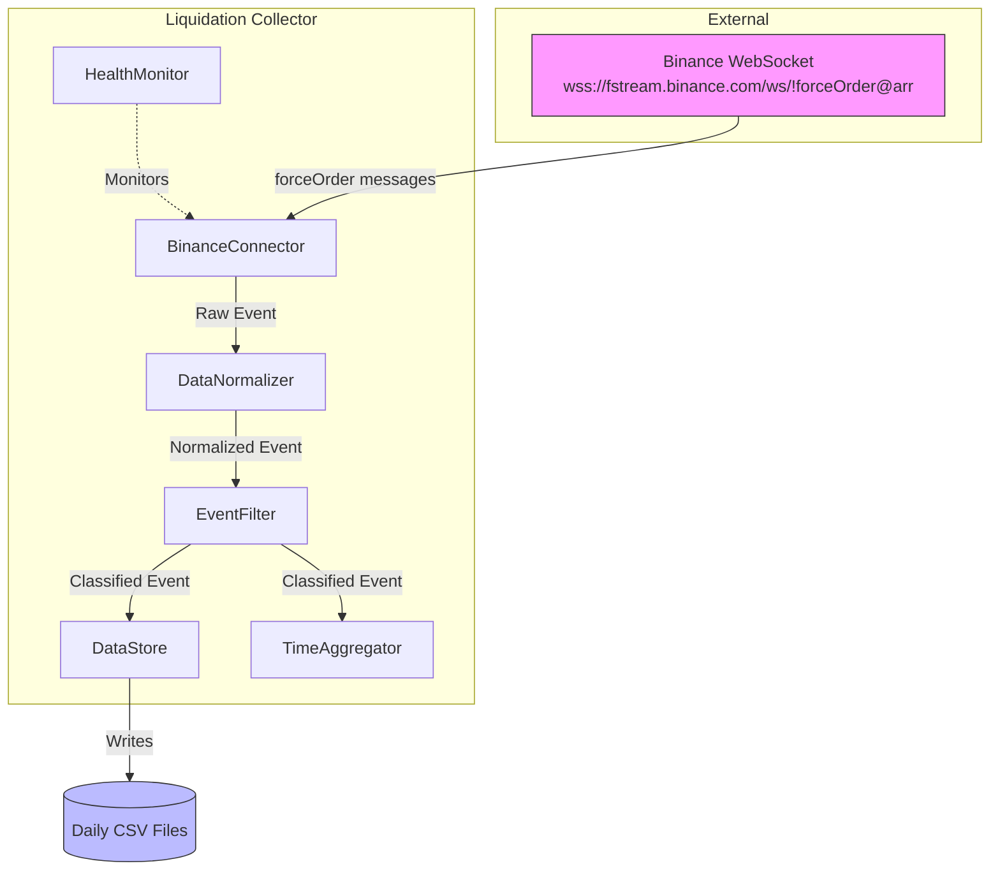

# Design Document: Liquidation Data Collector

## Overview

The Liquidation Data Collector is a real-time data collection system that streams liquidation events from Binance Futures via WebSocket, normalizes the data, filters for significant events, and persists them for analysis by the Mundave trading bot.

The system is designed as a single-process Python application with async I/O for efficient WebSocket handling. It prioritizes reliability (reconnection logic, data persistence) and simplicity (single exchange, CSV storage).

### Key Design Decisions

1. **Python with asyncio**: Chosen for excellent WebSocket library support (`websockets`) and async I/O capabilities
2. **CSV storage**: Simple, human-readable, easily importable into analysis tools - no database overhead
3. **In-memory aggregation**: Rolling windows maintained in memory for real-time queries; events older than 15 minutes are pruned
4. **Single-threaded async**: All operations (WebSocket, file I/O, aggregation) run in one event loop for simplicity

## Architecture



### Data Flow

1. **BinanceConnector** receives raw `forceOrder` WebSocket messages
2. **DataNormalizer** transforms raw data into unified `LiquidationEvent` format
3. **EventFilter** classifies events as significant/non-significant based on USD threshold
4. **DataStore** persists all events to daily CSV files
5. **TimeAggregator** maintains rolling window aggregations for real-time queries
6. **HealthMonitor** tracks connection status and event flow metrics

## Components and Interfaces

### BinanceConnector

Manages WebSocket connection to Binance Futures liquidation stream.

```python
class BinanceConnector:
    """Connects to Binance forceOrder WebSocket stream."""
    
    def __init__(self, on_event: Callable[[dict], Awaitable[None]]):
        """
        Args:
            on_event: Async callback invoked for each forceOrder message
        """
        pass
    
    async def connect(self) -> None:
        """Establish WebSocket connection. Handles reconnection internally."""
        pass
    
    async def disconnect(self) -> None:
        """Gracefully close WebSocket connection."""
        pass
    
    @property
    def is_connected(self) -> bool:
        """Returns True if WebSocket is currently connected."""
        pass
    
    @property
    def uptime_seconds(self) -> float:
        """Returns seconds since last successful connection."""
        pass
```

**Reconnection Strategy:**
- Exponential backoff: 1s → 2s → 4s → 8s → 16s → 30s (max)
- Automatic reconnection before 24-hour limit (reconnect at 23 hours)
- Responds to ping frames with pong immediately

### DataNormalizer

Transforms raw Binance messages into unified format.

```python
@dataclass
class LiquidationEvent:
    exchange: str           # "binance"
    symbol: str             # e.g., "BTCUSDT"
    side: str               # "long_liquidated" or "short_liquidated"
    usd_size: float         # quantity × average_price
    price: float            # liquidation price
    time: datetime          # UTC timestamp
    is_significant: bool    # Set by EventFilter, default False

class DataNormalizer:
    """Transforms raw exchange data into unified LiquidationEvent format."""
    
    @staticmethod
    def normalize_binance(raw: dict) -> LiquidationEvent:
        """
        Transform Binance forceOrder message to LiquidationEvent.
        
        Side mapping:
        - "SELL" → "long_liquidated" (long position closed, price going down)
        - "BUY" → "short_liquidated" (short position closed, price going up)
        """
        pass
    
    @staticmethod
    def to_dict(event: LiquidationEvent) -> dict:
        """Serialize event to dictionary."""
        pass
    
    @staticmethod
    def from_dict(data: dict) -> LiquidationEvent:
        """Deserialize event from dictionary."""
        pass
```

### EventFilter

Classifies events based on significance threshold.

```python
class EventFilter:
    """Filters and classifies liquidation events by USD size."""
    
    def __init__(self, threshold_usd: float = 25_000.0):
        """
        Args:
            threshold_usd: Minimum USD size for significant classification
        """
        pass
    
    def classify(self, event: LiquidationEvent) -> LiquidationEvent:
        """
        Returns event with is_significant field set based on threshold.
        """
        pass
    
    @property
    def threshold(self) -> float:
        """Returns current significance threshold."""
        pass
```

### DataStore

Persists events to daily CSV files.

```python
class DataStore:
    """Persists liquidation events to daily CSV files."""
    
    def __init__(self, data_dir: Path):
        """
        Args:
            data_dir: Directory for CSV files (created if not exists)
        """
        pass
    
    async def write(self, event: LiquidationEvent) -> None:
        """
        Append event to current day's CSV file.
        Creates new file with headers if day changes.
        """
        pass
    
    async def flush(self) -> None:
        """Force flush pending writes to disk."""
        pass
    
    async def close(self) -> None:
        """Flush and close file handles."""
        pass
```

**CSV Format:**
```csv
exchange,symbol,side,usd_size,price,time,is_significant
binance,BTCUSDT,long_liquidated,45230.50,67500.00,2024-01-15T14:32:05.123Z,true
binance,ETHUSDT,short_liquidated,12500.00,3200.00,2024-01-15T14:32:06.456Z,false
```

### TimeAggregator

Maintains rolling window aggregations.

```python
@dataclass
class WindowAggregation:
    window_minutes: int
    long_liquidated_usd: float
    short_liquidated_usd: float
    event_count: int

class TimeAggregator:
    """Maintains rolling time-window aggregations of liquidation data."""
    
    WINDOWS = [1, 5, 10, 15]  # minutes
    
    def __init__(self):
        pass
    
    def add_event(self, event: LiquidationEvent) -> None:
        """Add event to aggregation. Only significant events are counted."""
        pass
    
    def get_aggregations(self) -> list[WindowAggregation]:
        """
        Returns current aggregations for all time windows.
        Prunes expired events before calculating.
        """
        pass
    
    def prune_expired(self) -> None:
        """Remove events older than max window (15 minutes)."""
        pass
```

### HealthMonitor

Tracks system health metrics.

```python
@dataclass
class HealthMetrics:
    events_received_total: int
    events_filtered_significant: int
    connection_uptime_seconds: float
    last_event_time: datetime | None
    is_connected: bool

class HealthMonitor:
    """Monitors system health and logs warnings."""
    
    STALE_THRESHOLD_SECONDS = 300  # 5 minutes
    
    def __init__(self, connector: BinanceConnector):
        pass
    
    def record_event(self, event: LiquidationEvent) -> None:
        """Record event receipt for metrics."""
        pass
    
    def get_metrics(self) -> HealthMetrics:
        """Returns current health metrics."""
        pass
    
    async def check_health(self) -> None:
        """
        Periodic health check. Logs warning if no events for 5 minutes.
        Should be called periodically (e.g., every 30 seconds).
        """
        pass
```

### LiquidationCollector (Main Orchestrator)

```python
class LiquidationCollector:
    """Main orchestrator that coordinates all components."""
    
    def __init__(self, config: CollectorConfig):
        pass
    
    async def start(self) -> None:
        """Start the collector. Blocks until shutdown signal."""
        pass
    
    async def shutdown(self) -> None:
        """Graceful shutdown within 10 seconds."""
        pass
    
    def get_aggregations(self) -> list[WindowAggregation]:
        """Returns current time-window aggregations."""
        pass
    
    def get_health(self) -> HealthMetrics:
        """Returns current health metrics."""
        pass

@dataclass
class CollectorConfig:
    data_dir: Path = Path("./data")
    significance_threshold_usd: float = 25_000.0
    flush_interval_seconds: float = 5.0
```

## Data Models

### LiquidationEvent

The core data model representing a normalized liquidation event.

```python
@dataclass
class LiquidationEvent:
    exchange: str           # Source exchange identifier
    symbol: str             # Trading pair (e.g., "BTCUSDT")
    side: str               # "long_liquidated" or "short_liquidated"
    usd_size: float         # Dollar value of liquidation
    price: float            # Liquidation price
    time: datetime          # Event timestamp (UTC)
    is_significant: bool    # True if usd_size >= threshold
```

**Invariants:**
- `exchange` is always "binance"
- `side` is always one of: "long_liquidated", "short_liquidated"
- `usd_size` is always >= 0
- `time` is always timezone-aware (UTC)

### Raw Binance Message

```python
# Incoming WebSocket message structure
{
    "e": "forceOrder",
    "E": 1568014460893,      # Event time (ms)
    "o": {
        "s": "BTCUSDT",       # Symbol
        "S": "SELL",          # Side: SELL=long liquidated, BUY=short liquidated
        "o": "LIMIT",         # Order type
        "f": "IOC",           # Time in force
        "q": "0.014",         # Original quantity
        "p": "9910",          # Price
        "ap": "9910",         # Average price
        "X": "FILLED",        # Order status
        "l": "0.014",         # Last filled quantity
        "z": "0.014",         # Filled accumulated quantity
        "T": 1568014460893    # Trade time (ms)
    }
}
```

### CSV Schema

| Column | Type | Description |
|--------|------|-------------|
| exchange | string | Always "binance" |
| symbol | string | Trading pair |
| side | string | "long_liquidated" or "short_liquidated" |
| usd_size | float | Dollar value (quantity × avg_price) |
| price | float | Liquidation price |
| time | string | ISO 8601 UTC timestamp |
| is_significant | boolean | true if usd_size >= threshold |

### WindowAggregation

```python
@dataclass
class WindowAggregation:
    window_minutes: int         # 1, 5, 10, or 15
    long_liquidated_usd: float  # Total USD from long liquidations
    short_liquidated_usd: float # Total USD from short liquidations
    event_count: int            # Number of significant events
```


## Correctness Properties

*A property is a characteristic or behavior that should hold true across all valid executions of a system—essentially, a formal statement about what the system should do. Properties serve as the bridge between human-readable specifications and machine-verifiable correctness guarantees.*

### Property 1: Side Mapping Correctness

*For any* Binance forceOrder message with side "SELL" or "BUY", the DataNormalizer shall map "SELL" to "long_liquidated" and "BUY" to "short_liquidated".

**Validates: Requirements 2.3, 2.4**

### Property 2: Serialization Round-Trip

*For any* valid LiquidationEvent, serializing to dictionary via `to_dict()` then deserializing via `from_dict()` shall produce an equivalent event.

**Validates: Requirements 2.5**

### Property 3: Significance Classification

*For any* LiquidationEvent and any positive threshold value, the EventFilter shall set `is_significant = True` if and only if `usd_size >= threshold`.

**Validates: Requirements 3.2, 3.3**

### Property 4: USD Size Calculation

*For any* Binance forceOrder message with filled quantity `q` and average price `ap`, the normalized event's `usd_size` shall equal `q × ap`.

**Validates: Requirements 2.2**

### Property 5: CSV Persistence Round-Trip

*For any* LiquidationEvent written to the DataStore, reading back the CSV row and parsing it shall produce an equivalent event.

**Validates: Requirements 4.1**

### Property 6: Daily File Partitioning

*For any* two LiquidationEvents with timestamps on different UTC dates, they shall be written to different CSV files with filenames matching their respective dates.

**Validates: Requirements 4.2, 4.4**

### Property 7: Aggregation Sum Correctness

*For any* sequence of significant LiquidationEvents and any time window W, the aggregation's `long_liquidated_usd` shall equal the sum of `usd_size` for all events where `side == "long_liquidated"` and `event.time` is within W minutes of the current time.

**Validates: Requirements 5.1, 5.2, 5.3**

### Property 8: Expired Event Exclusion

*For any* LiquidationEvent with timestamp older than the window duration, that event shall not be included in the window's aggregation totals.

**Validates: Requirements 5.4**

### Property 9: Metrics Accuracy

*For any* sequence of N events processed where M are significant, the HealthMonitor's `events_received_total` shall equal N and `events_filtered_significant` shall equal M.

**Validates: Requirements 6.2**

### Property 10: Exponential Backoff Timing

*For any* sequence of K consecutive connection failures (K ≤ 6), the delay before attempt K shall be `min(2^(K-1), 30)` seconds.

**Validates: Requirements 1.4**

## Error Handling

### WebSocket Connection Errors

| Error | Handling | Recovery |
|-------|----------|----------|
| Connection refused | Log error, start backoff | Retry with exponential backoff |
| Connection timeout | Log warning, close socket | Retry with exponential backoff |
| Unexpected disconnect | Log error, record downtime | Immediate reconnection attempt |
| Invalid message format | Log warning with payload | Skip message, continue processing |
| Ping timeout | Log warning | Force reconnect |

### Data Processing Errors

| Error | Handling | Recovery |
|-------|----------|----------|
| Missing required field | Log warning with raw message | Skip event |
| Invalid numeric value | Log warning | Skip event |
| Invalid timestamp | Log warning | Use current time as fallback |

### File I/O Errors

| Error | Handling | Recovery |
|-------|----------|----------|
| Directory creation fails | Log error | Exit with error code |
| File write fails | Log error, buffer in memory | Retry on next flush |
| Disk full | Log critical error | Stop accepting new events, alert |

### Shutdown Handling

```python
async def shutdown(self) -> None:
    """Graceful shutdown sequence."""
    # 1. Stop accepting new events
    self._accepting_events = False
    
    # 2. Close WebSocket (with 5s timeout)
    try:
        await asyncio.wait_for(self.connector.disconnect(), timeout=5.0)
    except asyncio.TimeoutError:
        logger.warning("WebSocket close timed out")
    
    # 3. Flush pending writes (with 4s timeout)
    try:
        await asyncio.wait_for(self.data_store.close(), timeout=4.0)
    except asyncio.TimeoutError:
        logger.error("Data flush timed out, some data may be lost")
    
    # 4. Log final metrics
    logger.info(f"Shutdown complete. Final metrics: {self.health_monitor.get_metrics()}")
```

## Testing Strategy

### Unit Tests

Unit tests verify specific examples and edge cases:

1. **DataNormalizer tests**
   - Valid Binance message normalization
   - Side mapping: SELL → long_liquidated
   - Side mapping: BUY → short_liquidated
   - USD calculation with various quantities/prices
   - Timestamp conversion from milliseconds to datetime

2. **EventFilter tests**
   - Event at exactly threshold (boundary)
   - Event just below threshold
   - Event just above threshold
   - Zero USD size event
   - Custom threshold configuration

3. **DataStore tests**
   - CSV header creation on new file
   - Directory creation when missing
   - File rotation at midnight UTC
   - Flush behavior

4. **TimeAggregator tests**
   - Empty aggregation returns zeros
   - Single event aggregation
   - Event expiration at window boundary
   - Multiple windows calculated correctly

### Property-Based Tests

Property tests use Hypothesis (Python PBT library) with minimum 100 iterations per test.

```python
# Example property test structure
from hypothesis import given, strategies as st, settings

@settings(max_examples=100)
@given(st.sampled_from(["SELL", "BUY"]))
def test_side_mapping_correctness(side: str):
    """
    Feature: liquidation-data-collector, Property 1: Side Mapping Correctness
    For any Binance side value, mapping is deterministic and correct.
    """
    raw = create_binance_message(side=side)
    event = DataNormalizer.normalize_binance(raw)
    
    expected = "long_liquidated" if side == "SELL" else "short_liquidated"
    assert event.side == expected
```

**Property Test Coverage:**

| Property | Test File | Generators |
|----------|-----------|------------|
| P1: Side Mapping | test_normalizer_props.py | side ∈ {SELL, BUY} |
| P2: Serialization Round-Trip | test_normalizer_props.py | arbitrary LiquidationEvent |
| P3: Significance Classification | test_filter_props.py | usd_size: float, threshold: float |
| P4: USD Size Calculation | test_normalizer_props.py | quantity: float, price: float |
| P5: CSV Round-Trip | test_datastore_props.py | arbitrary LiquidationEvent |
| P6: Daily File Partitioning | test_datastore_props.py | two events with different dates |
| P7: Aggregation Sum | test_aggregator_props.py | list of events, window size |
| P8: Expired Event Exclusion | test_aggregator_props.py | events with various timestamps |
| P9: Metrics Accuracy | test_health_props.py | sequence of events |
| P10: Exponential Backoff | test_connector_props.py | failure count 1-10 |

### Integration Tests

1. **End-to-end flow**: Mock WebSocket → Collector → CSV file
2. **Reconnection behavior**: Simulate connection drops
3. **Graceful shutdown**: Verify data persistence on SIGTERM
4. **24-hour reconnection**: Verify proactive reconnection

### Test Configuration

```python
# conftest.py
import pytest
from hypothesis import settings, Verbosity

# Configure Hypothesis for CI
settings.register_profile("ci", max_examples=100, deadline=None)
settings.register_profile("dev", max_examples=10, deadline=None)
settings.load_profile("ci")
```
