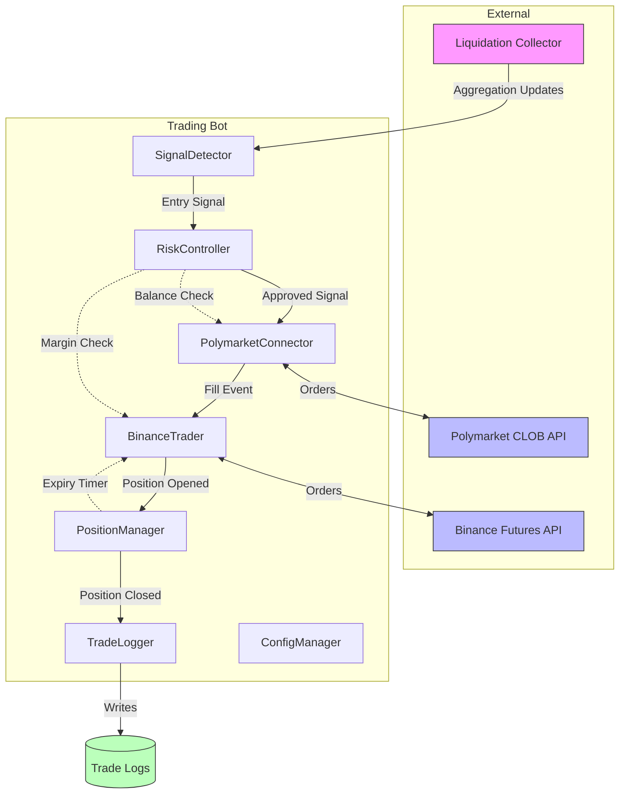

# Design Document: Liquidation Trading Bot

## Overview

The Liquidation Trading Bot is an automated trading system that executes a momentum-based strategy using liquidation data as entry signals. It places directional bets on Polymarket's 5-minute BTC binary options and hedges with inverse positions on Binance Futures at 3x leverage.

The system integrates with the existing Liquidation Data Collector to receive real-time aggregation updates, then orchestrates order execution across two exchanges with proper risk controls and position management.

### Key Design Decisions

1. **Event-Driven Architecture**: The bot reacts to aggregation updates from the collector rather than polling, ensuring timely signal detection
2. **Sequential Execution**: Polymarket order must fill before opening Binance hedge to avoid unhedged exposure
3. **Single Position Limit**: Only one Trade_Pair can be open at a time to simplify risk management
4. **Isolated Margin**: Binance hedge uses isolated margin to contain losses to the position
5. **Dry Run Default**: System starts in dry run mode to prevent accidental live trading
6. **CSV Logging**: Simple, human-readable trade logs for analysis and debugging

### Risk Warning

⚠️ This system implements ~2,400x effective leverage on Polymarket positions. Without a proven edge (>54% win rate), this strategy will result in consistent losses. The hedge only partially offsets risk.

## Architecture



### Data Flow

1. **SignalDetector** subscribes to aggregation updates from LiquidationCollector
2. **SignalDetector** generates Entry_Signal when liquidation threshold is met
3. **RiskController** validates signal against daily loss limit and balance requirements
4. **PolymarketConnector** places limit order at 10% discount
5. **PolymarketConnector** emits fill event when order executes
6. **BinanceTrader** opens inverse hedge position at 3x leverage
7. **PositionManager** tracks the Trade_Pair and sets 5-minute expiry timer
8. **PositionManager** triggers hedge closure at expiry
9. **TradeLogger** records all events to daily CSV files

## Components and Interfaces

### SignalDetector

Monitors liquidation aggregations and generates entry signals.

```python
@dataclass
class EntrySignal:
    signal_type: str        # "long_liquidation" or "short_liquidation"
    liquidation_usd: float  # Total USD liquidated in window
    timestamp: datetime     # Signal generation time
    dominant_side: str      # "long_liquidated" or "short_liquidated"
    long_usd: float         # Long liquidation amount
    short_usd: float        # Short liquidation amount

class SignalDetector:
    """Monitors liquidation aggregations and generates entry signals."""
    
    def __init__(
        self,
        collector: LiquidationCollector,
        threshold_min: float = 25_000.0,
        threshold_max: float = 100_000.0,
        window_minutes: int = 5,
        on_signal: Callable[[EntrySignal], Awaitable[None]] | None = None,
    ):
        """
        Args:
            collector: LiquidationCollector instance to subscribe to
            threshold_min: Minimum liquidation USD to trigger signal
            threshold_max: Maximum liquidation USD for valid signal
            window_minutes: Aggregation window to monitor (1, 5, 10, or 15)
            on_signal: Async callback invoked when signal is generated
        """
        pass
    
    async def start(self) -> None:
        """Start monitoring aggregations. Polls at 1-second intervals."""
        pass
    
    async def stop(self) -> None:
        """Stop monitoring."""
        pass
    
    def set_position_open(self, is_open: bool) -> None:
        """Set whether a position is currently open (blocks new signals)."""
        pass
    
    def check_signal(self) -> EntrySignal | None:
        """
        Check current aggregations for entry signal.
        Returns None if no signal or position is open.
        """
        pass
```

### PolymarketConnector

Interfaces with Polymarket CLOB API for order placement.

```python
@dataclass
class PolymarketOrder:
    order_id: str
    market_id: str          # 5-minute BTC binary market
    outcome: str            # "UP" or "DOWN"
    side: str               # Always "BUY"
    size: float             # USDC amount
    price: float            # Limit price (0-1)
    status: str             # "pending", "filled", "cancelled", "expired"
    fill_price: float | None
    fill_time: datetime | None

class PolymarketConnector:
    """Interfaces with Polymarket CLOB API for order placement."""
    
    def __init__(
        self,
        private_key: str,
        api_url: str = "https://clob.polymarket.com",
        dry_run: bool = True,
    ):
        """
        Args:
            private_key: Ethereum wallet private key for EIP-712 signing
            api_url: Polymarket CLOB API endpoint
            dry_run: If True, simulate orders without API calls
        """
        pass
    
    async def connect(self) -> bool:
        """Verify API connectivity. Returns True if successful."""
        pass
    
    async def get_balance(self) -> float:
        """Get available USDC balance."""
        pass
    
    async def get_current_price(self, outcome: str) -> float:
        """Get current best ask price for outcome (UP/DOWN)."""
        pass
    
    async def place_order(
        self,
        outcome: str,
        size: float,
        discount_percent: float = 10.0,
        timeout_seconds: float = 30.0,
    ) -> PolymarketOrder:
        """
        Place limit order at discount below current price.
        Waits for fill or cancels after timeout.
        
        Args:
            outcome: "UP" or "DOWN"
            size: USDC amount to bet
            discount_percent: Percentage below best ask for limit price
            timeout_seconds: Cancel order if not filled within this time
            
        Returns:
            PolymarketOrder with final status
        """
        pass
    
    async def cancel_order(self, order_id: str) -> bool:
        """Cancel pending order. Returns True if successful."""
        pass
```

### BinanceTrader

Interfaces with Binance Futures API for hedge positions.

```python
@dataclass
class BinancePosition:
    position_id: str
    symbol: str             # "BTCUSDT"
    side: str               # "LONG" or "SHORT"
    size: float             # Position size in BTC
    leverage: int           # Leverage multiplier
    entry_price: float
    margin_mode: str        # "isolated"
    status: str             # "open", "closed"
    pnl: float | None       # Realized PnL when closed

class BinanceTrader:
    """Interfaces with Binance Futures API for hedge positions."""
    
    def __init__(
        self,
        api_key: str,
        api_secret: str,
        api_url: str = "https://fapi.binance.com",
        dry_run: bool = True,
    ):
        """
        Args:
            api_key: Binance API key
            api_secret: Binance API secret for HMAC signing
            api_url: Binance Futures API endpoint
            dry_run: If True, simulate orders without API calls
        """
        pass
    
    async def connect(self) -> bool:
        """Verify API connectivity and permissions. Returns True if successful."""
        pass
    
    async def get_available_margin(self) -> float:
        """Get available margin in USDT."""
        pass
    
    async def get_current_price(self, symbol: str = "BTCUSDT") -> float:
        """Get current mark price."""
        pass
    
    async def set_leverage(self, symbol: str, leverage: int) -> bool:
        """Set leverage for symbol. Returns True if successful."""
        pass
    
    async def set_margin_mode(self, symbol: str, mode: str = "isolated") -> bool:
        """Set margin mode for symbol. Returns True if successful."""
        pass
    
    async def open_position(
        self,
        side: str,
        size_usd: float,
        leverage: int = 3,
        max_retries: int = 3,
    ) -> BinancePosition:
        """
        Open hedge position with market order.
        
        Args:
            side: "LONG" or "SHORT"
            size_usd: USD value of position
            leverage: Leverage multiplier
            max_retries: Number of retry attempts on failure
            
        Returns:
            BinancePosition with entry details
        """
        pass
    
    async def close_position(self, position_id: str) -> BinancePosition:
        """Close position with market order. Returns position with PnL."""
        pass
```

### PositionManager

Tracks open positions and manages lifecycle.

```python
@dataclass
class TradePair:
    trade_id: str
    polymarket_order: PolymarketOrder
    binance_position: BinancePosition | None
    direction: str          # "UP" or "DOWN"
    entry_time: datetime
    expiry_time: datetime   # entry_time + 5 minutes
    status: str             # "pending", "open", "closing", "closed"
    polymarket_pnl: float | None
    binance_pnl: float | None
    total_pnl: float | None

class PositionManager:
    """Tracks open positions and manages lifecycle."""
    
    def __init__(
        self,
        binance_trader: BinanceTrader,
        on_position_closed: Callable[[TradePair], Awaitable[None]] | None = None,
    ):
        """
        Args:
            binance_trader: BinanceTrader instance for closing hedges
            on_position_closed: Callback when position is fully closed
        """
        pass
    
    def has_open_position(self) -> bool:
        """Returns True if a Trade_Pair is currently open."""
        pass
    
    def get_open_position(self) -> TradePair | None:
        """Returns current open Trade_Pair or None."""
        pass
    
    async def open_trade_pair(
        self,
        polymarket_order: PolymarketOrder,
        binance_position: BinancePosition | None,
    ) -> TradePair:
        """
        Create and track new Trade_Pair.
        Starts expiry timer for automatic hedge closure.
        """
        pass
    
    async def close_trade_pair(self, trade_id: str) -> TradePair:
        """Close Trade_Pair and calculate PnL."""
        pass
    
    async def check_expiries(self) -> None:
        """Check for expired positions and close hedges. Called periodically."""
        pass
    
    def get_all_trades(self) -> list[TradePair]:
        """Returns all Trade_Pairs (open and closed)."""
        pass
```

### RiskController

Enforces position limits and risk parameters.

```python
class RiskController:
    """Enforces position limits and risk parameters."""
    
    def __init__(
        self,
        max_daily_loss: float = 100.0,
        max_concurrent_positions: int = 1,
        polymarket_connector: PolymarketConnector | None = None,
        binance_trader: BinanceTrader | None = None,
    ):
        """
        Args:
            max_daily_loss: Maximum daily realized loss in USD
            max_concurrent_positions: Maximum open Trade_Pairs
            polymarket_connector: For balance checks
            binance_trader: For margin checks
        """
        pass
    
    def record_pnl(self, pnl: float) -> None:
        """Record realized PnL from closed position."""
        pass
    
    def get_daily_pnl(self) -> float:
        """Returns current daily realized PnL."""
        pass
    
    def is_daily_limit_reached(self) -> bool:
        """Returns True if daily loss limit is reached."""
        pass
    
    async def can_open_position(
        self,
        bet_size: float,
        hedge_margin_required: float,
        current_open_positions: int,
    ) -> tuple[bool, str]:
        """
        Check if new position can be opened.
        
        Returns:
            (allowed, reason) - reason explains why if not allowed
        """
        pass
    
    def reset_daily_pnl(self) -> None:
        """Reset daily PnL counter. Called at UTC midnight."""
        pass
```

### TradeLogger

Records all trade activity to CSV files.

```python
@dataclass
class TradeLogEntry:
    timestamp: datetime
    event_type: str         # "signal", "order_placed", "order_filled", "position_closed"
    trade_id: str | None
    exchange: str | None    # "polymarket" or "binance"
    side: str | None        # "UP", "DOWN", "LONG", "SHORT"
    size: float | None
    price: float | None
    pnl: float | None
    is_dry_run: bool
    details: str | None     # JSON string with additional data

class TradeLogger:
    """Records all trade activity to CSV files."""
    
    def __init__(self, log_dir: Path, flush_interval_seconds: float = 5.0):
        """
        Args:
            log_dir: Directory for trade log CSV files
            flush_interval_seconds: Interval for flushing writes to disk
        """
        pass
    
    async def log_signal(self, signal: EntrySignal, is_dry_run: bool) -> None:
        """Log entry signal detection."""
        pass
    
    async def log_order_placed(
        self,
        trade_id: str,
        exchange: str,
        side: str,
        size: float,
        price: float,
        is_dry_run: bool,
    ) -> None:
        """Log order placement."""
        pass
    
    async def log_order_filled(
        self,
        trade_id: str,
        exchange: str,
        side: str,
        size: float,
        fill_price: float,
        is_dry_run: bool,
    ) -> None:
        """Log order fill."""
        pass
    
    async def log_position_closed(
        self,
        trade_id: str,
        exchange: str,
        pnl: float,
        is_dry_run: bool,
    ) -> None:
        """Log position closure with PnL."""
        pass
    
    async def flush(self) -> None:
        """Force flush pending writes to disk."""
        pass
    
    async def close(self) -> None:
        """Flush and close file handles."""
        pass
```

### ConfigManager

Loads and validates configuration from YAML.

```python
@dataclass
class TradingConfig:
    # Signal detection
    entry_threshold_min: float = 25_000.0
    entry_threshold_max: float = 100_000.0
    liquidation_window_minutes: int = 5
    
    # Polymarket
    bet_size: float = 10.0
    discount_percent: float = 10.0
    polymarket_private_key: str = ""
    
    # Binance
    hedge_leverage: int = 3
    hedge_size: float = 15.0  # USD value for hedge
    binance_api_key: str = ""
    binance_api_secret: str = ""
    
    # Risk
    max_daily_loss: float = 100.0
    max_concurrent_positions: int = 1
    
    # Operational
    dry_run: bool = True
    log_dir: Path = field(default_factory=lambda: Path("./logs"))

class ConfigManager:
    """Loads and validates configuration from YAML."""
    
    @staticmethod
    def load(config_path: Path) -> TradingConfig:
        """
        Load configuration from YAML file.
        Missing values use defaults.
        
        Raises:
            ConfigValidationError: If values are invalid
        """
        pass
    
    @staticmethod
    def validate(config: TradingConfig) -> list[str]:
        """
        Validate configuration values.
        Returns list of error messages (empty if valid).
        
        Validation rules:
        - entry_threshold_min > 0
        - entry_threshold_max > entry_threshold_min
        - bet_size > 0
        - hedge_leverage >= 1 and <= 20
        - discount_percent >= 0 and <= 50
        - max_daily_loss > 0
        """
        pass
```

### TradingBot (Main Orchestrator)

```python
class TradingBot:
    """Main orchestrator that coordinates all trading components."""
    
    def __init__(self, config: TradingConfig, collector: LiquidationCollector):
        """
        Args:
            config: Trading configuration
            collector: LiquidationCollector instance for signal detection
        """
        pass
    
    async def start(self) -> None:
        """
        Start the trading bot.
        1. Verify exchange connectivity
        2. Start signal detection
        3. Block until shutdown signal
        """
        pass
    
    async def shutdown(self) -> None:
        """
        Graceful shutdown within 30 seconds.
        1. Stop accepting new signals
        2. Close open Binance positions
        3. Flush trade logs
        """
        pass
    
    async def _handle_signal(self, signal: EntrySignal) -> None:
        """Process entry signal through the trading pipeline."""
        pass
    
    async def _handle_polymarket_fill(self, order: PolymarketOrder) -> None:
        """Handle Polymarket order fill by opening Binance hedge."""
        pass
```

## Data Models

### EntrySignal

```python
@dataclass
class EntrySignal:
    signal_type: str        # "long_liquidation" or "short_liquidation"
    liquidation_usd: float  # Total USD liquidated in window
    timestamp: datetime     # Signal generation time (UTC)
    dominant_side: str      # "long_liquidated" or "short_liquidated"
    long_usd: float         # Long liquidation USD in window
    short_usd: float        # Short liquidation USD in window
```

**Invariants:**
- `signal_type` is always "long_liquidation" or "short_liquidation"
- `liquidation_usd` equals `long_usd + short_usd`
- `dominant_side` matches the side with higher USD value
- `timestamp` is timezone-aware (UTC)

### TradePair

```python
@dataclass
class TradePair:
    trade_id: str                           # UUID
    polymarket_order: PolymarketOrder       # Polymarket bet details
    binance_position: BinancePosition | None # Hedge (None if failed)
    direction: str                          # "UP" or "DOWN"
    entry_time: datetime                    # When Polymarket filled
    expiry_time: datetime                   # entry_time + 5 minutes
    status: str                             # "pending", "open", "closing", "closed"
    polymarket_pnl: float | None            # PnL from Polymarket bet
    binance_pnl: float | None               # PnL from Binance hedge
    total_pnl: float | None                 # Combined PnL
```

**Invariants:**
- `trade_id` is a valid UUID string
- `direction` is always "UP" or "DOWN"
- `expiry_time` equals `entry_time + timedelta(minutes=5)`
- `status` transitions: pending → open → closing → closed
- `total_pnl` equals `polymarket_pnl + binance_pnl` when both are set

### Trade Log CSV Schema

| Column | Type | Description |
|--------|------|-------------|
| timestamp | string | ISO 8601 UTC timestamp |
| event_type | string | "signal", "order_placed", "order_filled", "position_closed" |
| trade_id | string | UUID of Trade_Pair (null for signals) |
| exchange | string | "polymarket" or "binance" (null for signals) |
| side | string | "UP", "DOWN", "LONG", "SHORT" |
| size | float | Order/position size in USD |
| price | float | Order/fill price |
| pnl | float | Realized PnL (null except for position_closed) |
| is_dry_run | boolean | true if simulated trade |
| details | string | JSON with additional data |

### Configuration YAML Schema

```yaml
# config.yaml
signal:
  entry_threshold_min: 25000
  entry_threshold_max: 100000
  liquidation_window_minutes: 5

polymarket:
  bet_size: 10
  discount_percent: 10
  private_key: "${POLYMARKET_PRIVATE_KEY}"  # From environment

binance:
  hedge_leverage: 3
  hedge_size: 15
  api_key: "${BINANCE_API_KEY}"
  api_secret: "${BINANCE_API_SECRET}"

risk:
  max_daily_loss: 100
  max_concurrent_positions: 1

operational:
  dry_run: true
  log_dir: "./logs"
```


## Correctness Properties

*A property is a characteristic or behavior that should hold true across all valid executions of a system—essentially, a formal statement about what the system should do. Properties serve as the bridge between human-readable specifications and machine-verifiable correctness guarantees.*

### Property 1: Signal Threshold Detection

*For any* aggregation with total liquidation USD (long + short), the SignalDetector shall generate a signal if and only if the total is >= entry_threshold_min AND <= entry_threshold_max AND long_usd != short_usd AND no position is currently open.

**Validates: Requirements 1.2, 1.6, 1.7**

### Property 2: Signal Type Classification

*For any* aggregation where long_liquidated_usd != short_liquidated_usd, the signal_type shall be "long_liquidation" when long_liquidated_usd > short_liquidated_usd, and "short_liquidation" when short_liquidated_usd > long_liquidated_usd.

**Validates: Requirements 1.4, 1.5**

### Property 3: Entry Signal Data Completeness

*For any* generated EntrySignal, it shall contain all required fields: signal_type (valid enum), liquidation_usd (equals long_usd + short_usd), timestamp (UTC), dominant_side (matches higher USD side), long_usd (>= 0), and short_usd (>= 0).

**Validates: Requirements 1.3**

### Property 4: Signal to Polymarket Outcome Mapping

*For any* EntrySignal, the Polymarket order outcome shall be "DOWN" when signal_type is "long_liquidation", and "UP" when signal_type is "short_liquidation".

**Validates: Requirements 2.1, 2.2**

### Property 5: Limit Order Discount Calculation

*For any* current best ask price P and discount percentage D (0 <= D <= 100), the limit order price shall equal P × (1 - D/100).

**Validates: Requirements 2.3**

### Property 6: Polymarket Outcome to Binance Hedge Mapping

*For any* filled Polymarket order, the Binance hedge direction shall be "SHORT" when outcome is "UP", and "LONG" when outcome is "DOWN".

**Validates: Requirements 3.1, 3.2**

### Property 7: Binance Position Size Calculation

*For any* hedge_size S, current_price P (P > 0), and leverage L (L >= 1), the position size in BTC shall equal (S / P) × L.

**Validates: Requirements 3.5**

### Property 8: Trade_Pair Data Completeness

*For any* created TradePair, it shall contain: a valid UUID trade_id, polymarket_order with all fields, direction ("UP" or "DOWN"), entry_time (UTC), expiry_time (entry_time + 5 minutes), and status (valid state).

**Validates: Requirements 4.1, 4.2**

### Property 9: Position Expiry Timing

*For any* TradePair with entry_time T, the hedge position shall be closed when current_time >= T + 5 minutes.

**Validates: Requirements 4.3**

### Property 10: PnL Calculation Correctness

*For any* closed TradePair with Polymarket entry price P_entry, Polymarket outcome (win/lose), Binance entry price B_entry, Binance exit price B_exit, and position direction, the total_pnl shall equal polymarket_pnl + binance_pnl where each component is calculated correctly based on the position direction and prices.

**Validates: Requirements 4.5**

### Property 11: Single Position Limit

*For any* state where a TradePair has status "open" or "pending", attempting to open a new TradePair shall be rejected.

**Validates: Requirements 4.6, 5.3**

### Property 12: Daily Loss Limit Enforcement

*For any* sequence of closed trades where cumulative realized loss >= max_daily_loss, all subsequent Entry_Signals shall be blocked until UTC day changes.

**Validates: Requirements 5.1, 5.2**

### Property 13: Balance Check Before Trade

*For any* trade attempt, if Polymarket balance < bet_size OR Binance available margin < required hedge margin, the trade shall be blocked.

**Validates: Requirements 5.4, 5.5, 5.6**

### Property 14: Daily PnL Tracking Accuracy

*For any* sequence of N closed trades with individual PnLs [p1, p2, ..., pN], the daily_pnl shall equal the sum of all individual PnLs.

**Validates: Requirements 5.7**

### Property 15: Trade Event Logging Completeness

*For any* trade lifecycle (signal → order_placed → order_filled → position_closed), each event shall be logged with all required fields: timestamp, event_type, trade_id (where applicable), exchange, side, size, price, pnl (for closes), and is_dry_run.

**Validates: Requirements 6.1, 6.2, 6.3, 6.4, 6.6**

### Property 16: Daily Log File Partitioning

*For any* two log entries with timestamps on different UTC dates, they shall be written to different CSV files with filenames matching pattern `trades_YYYY-MM-DD.csv`.

**Validates: Requirements 6.5**

### Property 17: Configuration Default Values

*For any* YAML configuration file with missing optional fields, loading shall produce a TradingConfig with default values for all missing fields.

**Validates: Requirements 7.2, 7.4**

### Property 18: Configuration Validation

*For any* TradingConfig with invalid values (bet_size <= 0, hedge_leverage < 1 or > 20, discount_percent < 0 or > 50, max_daily_loss <= 0, entry_threshold_max <= entry_threshold_min), validation shall return error messages identifying the invalid fields.

**Validates: Requirements 7.3, 7.5**

### Property 19: Exponential Backoff Timing

*For any* sequence of K consecutive API failures (K >= 1), the delay before retry K shall follow exponential backoff: min(2^(K-1), max_delay) seconds.

**Validates: Requirements 8.5**

### Property 20: Dry Run Mode Behavior

*For any* trade execution while dry_run is enabled, no actual API calls shall be made to exchanges, log entries shall have is_dry_run=true, and simulated fill prices shall be based on current market prices.

**Validates: Requirements 10.2, 10.3, 10.4, 10.5**

## Error Handling

### Exchange API Errors

| Error | Component | Handling | Recovery |
|-------|-----------|----------|----------|
| Connection refused | PolymarketConnector, BinanceTrader | Log error | Exit on startup; retry with backoff during operation |
| Authentication failed | PolymarketConnector, BinanceTrader | Log error with details | Exit with clear error message |
| Rate limited (429) | PolymarketConnector, BinanceTrader | Log warning | Exponential backoff retry |
| Insufficient balance | PolymarketConnector | Log warning | Block trade, notify RiskController |
| Insufficient margin | BinanceTrader | Log warning | Block trade, notify RiskController |
| Order rejected | PolymarketConnector, BinanceTrader | Log error with reason | Cancel trade flow, notify PositionManager |
| Order timeout | PolymarketConnector | Log warning | Cancel order, notify PositionManager |
| Position close failed | BinanceTrader | Log error | Retry up to 3 times, then log for manual intervention |

### Signal Detection Errors

| Error | Handling | Recovery |
|-------|----------|----------|
| Collector disconnected | Log warning | Wait for reconnection, pause signal detection |
| Invalid aggregation data | Log warning | Skip signal check for this cycle |
| Signal during open position | Silently ignore | No action needed |

### Position Management Errors

| Error | Handling | Recovery |
|-------|----------|----------|
| Hedge open failed after Polymarket fill | Log error, mark as unhedged | Continue tracking, close at expiry anyway |
| Expiry timer missed | Log warning | Close immediately when detected |
| PnL calculation error | Log error | Record as null, flag for review |

### File I/O Errors

| Error | Handling | Recovery |
|-------|----------|----------|
| Log directory creation fails | Log error | Exit with error |
| CSV write fails | Log error, buffer in memory | Retry on next flush |
| Disk full | Log critical | Stop accepting new trades, alert |

### Shutdown Error Handling

```python
async def shutdown(self) -> None:
    """Graceful shutdown within 30 seconds."""
    logger.info("Shutdown signal received")
    
    # 1. Stop accepting new signals (immediate)
    self._signal_detector.stop()
    self._accepting_signals = False
    
    # 2. Close open Binance positions (20s timeout)
    open_position = self._position_manager.get_open_position()
    if open_position and open_position.binance_position:
        try:
            await asyncio.wait_for(
                self._binance_trader.close_position(
                    open_position.binance_position.position_id
                ),
                timeout=20.0
            )
            logger.info(f"Closed hedge position {open_position.trade_id}")
        except asyncio.TimeoutError:
            logger.error(
                f"Failed to close position {open_position.trade_id}. "
                f"MANUAL INTERVENTION REQUIRED: {open_position.binance_position}"
            )
        except Exception as e:
            logger.error(f"Error closing position: {e}. Manual intervention required.")
    
    # 3. Flush trade logs (8s timeout)
    try:
        await asyncio.wait_for(self._trade_logger.close(), timeout=8.0)
    except asyncio.TimeoutError:
        logger.error("Trade log flush timed out, some logs may be lost")
    
    logger.info("Shutdown complete")
```

## Testing Strategy

### Unit Tests

Unit tests verify specific examples and edge cases:

1. **SignalDetector tests**
   - Signal generated at exact threshold_min boundary
   - Signal generated at exact threshold_max boundary
   - No signal below threshold_min
   - No signal above threshold_max
   - No signal when long_usd equals short_usd
   - No signal when position is open
   - Correct signal_type for dominant long liquidations
   - Correct signal_type for dominant short liquidations

2. **PolymarketConnector tests**
   - Correct outcome for long_liquidation signal (DOWN)
   - Correct outcome for short_liquidation signal (UP)
   - Limit price calculation with various discounts
   - Order cancellation after timeout
   - Dry run mode returns simulated order

3. **BinanceTrader tests**
   - Correct hedge direction for UP outcome (SHORT)
   - Correct hedge direction for DOWN outcome (LONG)
   - Position size calculation with various prices/leverage
   - Retry behavior on failure (3 attempts)
   - Isolated margin mode is set
   - Dry run mode returns simulated position

4. **PositionManager tests**
   - TradePair creation with all required fields
   - Expiry time is entry_time + 5 minutes
   - Only one position allowed at a time
   - PnL calculation for winning Polymarket bet
   - PnL calculation for losing Polymarket bet
   - Hedge closure at expiry

5. **RiskController tests**
   - Trade blocked when daily loss limit reached
   - Trade blocked when Polymarket balance insufficient
   - Trade blocked when Binance margin insufficient
   - Daily PnL resets at UTC midnight
   - Cumulative PnL tracking accuracy

6. **TradeLogger tests**
   - CSV file created with correct headers
   - File rotation at UTC midnight
   - All event types logged with required fields
   - Dry run flag correctly set

7. **ConfigManager tests**
   - Default values applied for missing fields
   - Invalid bet_size (negative) rejected
   - Invalid leverage (> 20) rejected
   - Invalid discount (> 50%) rejected
   - Environment variable substitution works

### Property-Based Tests

Property tests use Hypothesis (Python PBT library) with minimum 100 iterations per test.

```python
from hypothesis import given, strategies as st, settings

@settings(max_examples=100)
@given(
    long_usd=st.floats(min_value=0, max_value=1_000_000),
    short_usd=st.floats(min_value=0, max_value=1_000_000),
    threshold_min=st.floats(min_value=1000, max_value=50_000),
    threshold_max=st.floats(min_value=50_001, max_value=200_000),
)
def test_signal_threshold_detection(long_usd, short_usd, threshold_min, threshold_max):
    """
    Feature: liquidation-trading-bot, Property 1: Signal Threshold Detection
    """
    total = long_usd + short_usd
    detector = SignalDetector(threshold_min=threshold_min, threshold_max=threshold_max)
    
    signal = detector.check_signal_from_values(long_usd, short_usd)
    
    should_signal = (
        total >= threshold_min and 
        total <= threshold_max and 
        long_usd != short_usd
    )
    
    assert (signal is not None) == should_signal
```

**Property Test Coverage:**

| Property | Test File | Generators |
|----------|-----------|------------|
| P1: Signal Threshold | test_signal_props.py | long_usd, short_usd, thresholds |
| P2: Signal Classification | test_signal_props.py | long_usd, short_usd (unequal) |
| P3: Signal Data Completeness | test_signal_props.py | arbitrary valid aggregations |
| P4: Signal to Outcome Mapping | test_polymarket_props.py | signal_type ∈ {long, short} |
| P5: Discount Calculation | test_polymarket_props.py | price: float, discount: 0-100 |
| P6: Outcome to Hedge Mapping | test_binance_props.py | outcome ∈ {UP, DOWN} |
| P7: Position Size Calculation | test_binance_props.py | size, price, leverage |
| P8: TradePair Completeness | test_position_props.py | arbitrary TradePair |
| P9: Expiry Timing | test_position_props.py | entry_time, current_time |
| P10: PnL Calculation | test_position_props.py | entry/exit prices, direction |
| P11: Single Position Limit | test_position_props.py | sequence of open attempts |
| P12: Daily Loss Limit | test_risk_props.py | sequence of PnLs, limit |
| P13: Balance Check | test_risk_props.py | balance, requirement pairs |
| P14: Daily PnL Tracking | test_risk_props.py | sequence of PnLs |
| P15: Logging Completeness | test_logger_props.py | arbitrary trade events |
| P16: Log File Partitioning | test_logger_props.py | events with different dates |
| P17: Config Defaults | test_config_props.py | partial YAML configs |
| P18: Config Validation | test_config_props.py | invalid config values |
| P19: Exponential Backoff | test_retry_props.py | failure count 1-10 |
| P20: Dry Run Mode | test_dryrun_props.py | trade sequences |

### Integration Tests

1. **End-to-end trade flow**: Mock collector → Signal → Polymarket order → Binance hedge → Expiry → Close
2. **Dry run full cycle**: Verify no API calls made, logs contain [DRY RUN]
3. **Risk limit enforcement**: Simulate losses until daily limit, verify blocking
4. **Graceful shutdown**: Start with open position, send SIGTERM, verify hedge closed
5. **Exchange connectivity check**: Mock API failures on startup, verify exit behavior
6. **Position expiry**: Create position, advance time 5 minutes, verify hedge closure

### Test Configuration

```python
# conftest.py
import pytest
from hypothesis import settings, Verbosity

# Configure Hypothesis for CI
settings.register_profile("ci", max_examples=100, deadline=None)
settings.register_profile("dev", max_examples=10, deadline=None)
settings.load_profile("ci")

@pytest.fixture
def mock_collector():
    """Mock LiquidationCollector for testing."""
    pass

@pytest.fixture
def trading_config():
    """Default test configuration."""
    return TradingConfig(
        entry_threshold_min=25_000,
        entry_threshold_max=100_000,
        bet_size=10,
        hedge_leverage=3,
        dry_run=True,
    )
```
