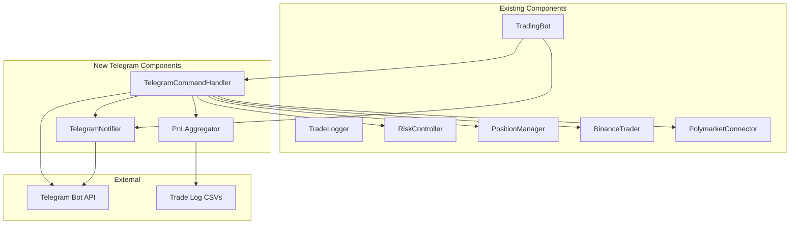

# Design Document: Telegram Notifications

## Overview

This design describes the Telegram Notifications feature for the Liquidation Trading Bot. The feature adds real-time notifications for bot lifecycle events (startup, shutdown, signals, trades, errors) and interactive commands (/pnl, /status, /balance) via Telegram Bot API.

The implementation introduces three new components:
- **TelegramNotifier**: Sends formatted messages to Telegram with deduplication
- **TelegramCommandHandler**: Processes incoming Telegram commands via polling
- **PnLAggregator**: Reads CSV trade logs and calculates PnL for date ranges

These components integrate with the existing TradingBot lifecycle without modifying core trading logic.

## Architecture



### Integration Points

1. **TradingBot.start()**: Initialize TelegramNotifier and TelegramCommandHandler, send startup notification
2. **TradingBot.shutdown()**: Send shutdown notification with session summary
3. **TradingBot._handle_signal()**: Send signal notification (detected or blocked)
4. **TradingBot._handle_polymarket_fill()**: Send trade entry notification
5. **TradingBot._handle_position_closed()**: Send trade close notification with PnL

## Components and Interfaces

### TelegramConfig (Extension to TradingConfig)

Add Telegram-specific fields to the existing TradingConfig dataclass:

```python
@dataclass
class TradingConfig:
    # ... existing fields ...
    
    # Telegram
    telegram_enabled: bool = False
    telegram_token: str = ""
    telegram_chat_id: str = ""
```

Environment variables: `TELEGRAM_ENABLED`, `TELEGRAM_TOKEN`, `TELEGRAM_CHAT_ID`

### TelegramNotifier

Responsible for sending formatted messages to Telegram with deduplication.

```python
class TelegramNotifier:
    def __init__(
        self,
        token: str,
        chat_id: str,
        dry_run: bool,
        enabled: bool = True,
    ) -> None: ...
    
    async def send_startup(
        self,
        config_summary: dict,
        timestamp: datetime,
    ) -> None: ...
    
    async def send_shutdown(
        self,
        reason: str,
        session_trades: int,
        session_pnl: float,
        timestamp: datetime,
    ) -> None: ...
    
    async def send_signal(
        self,
        signal: EntrySignal,
    ) -> None: ...
    
    async def send_signal_blocked(
        self,
        signal: EntrySignal,
        reason: str,
    ) -> None: ...
    
    async def send_trade_entry(
        self,
        trade_id: str,
        direction: str,
        entry_price: float,
        bet_size: float,
    ) -> None: ...
    
    async def send_hedge_opened(
        self,
        trade_id: str,
        side: str,
        entry_price: float,
        leverage: int,
    ) -> None: ...
    
    async def send_trade_closed(
        self,
        trade_id: str,
        polymarket_pnl: float | None,
        binance_pnl: float | None,
        total_pnl: float,
        daily_pnl: float,
    ) -> None: ...
    
    async def send_error(
        self,
        error_type: str,
        exchange: str,
        message: str,
    ) -> None: ...
    
    async def send_risk_alert(
        self,
        alert_type: str,
        details: str,
    ) -> None: ...
    
    async def close(self) -> None: ...
```

### TelegramCommandHandler

Handles incoming Telegram commands via long polling.

```python
class TelegramCommandHandler:
    def __init__(
        self,
        token: str,
        chat_id: str,
        notifier: TelegramNotifier,
        pnl_aggregator: PnLAggregator,
        risk_controller: RiskController,
        position_manager: PositionManager,
        binance_trader: BinanceTrader,
        polymarket_connector: PolymarketConnector,
        dry_run: bool,
        start_time: datetime,
    ) -> None: ...
    
    async def start(self) -> None: ...
    
    async def stop(self) -> None: ...
    
    async def _handle_pnl_command(self, args: list[str]) -> str: ...
    
    async def _handle_status_command(self) -> str: ...
    
    async def _handle_balance_command(self) -> str: ...
```

### PnLAggregator

Reads CSV trade logs and calculates PnL statistics.

```python
@dataclass
class PnLSummary:
    start_date: date
    end_date: date
    total_pnl: float
    trade_count: int
    win_count: int
    loss_count: int
    win_rate: float

class PnLAggregator:
    def __init__(self, log_dir: Path) -> None: ...
    
    def get_pnl_for_date(self, target_date: date) -> PnLSummary: ...
    
    def get_pnl_for_range(
        self,
        start_date: date,
        end_date: date,
    ) -> PnLSummary: ...
```

### MessageFormatter

Utility class for formatting Telegram messages with MarkdownV2.

```python
class MessageFormatter:
    @staticmethod
    def format_startup(
        dry_run: bool,
        config: dict,
        timestamp: datetime,
    ) -> str: ...
    
    @staticmethod
    def format_shutdown(
        dry_run: bool,
        reason: str,
        trades: int,
        pnl: float,
        timestamp: datetime,
    ) -> str: ...
    
    @staticmethod
    def format_signal(
        dry_run: bool,
        signal: EntrySignal,
    ) -> str: ...
    
    @staticmethod
    def format_trade_entry(
        dry_run: bool,
        trade_id: str,
        direction: str,
        price: float,
        size: float,
    ) -> str: ...
    
    @staticmethod
    def format_pnl_summary(
        summary: PnLSummary,
    ) -> str: ...
    
    @staticmethod
    def format_status(
        dry_run: bool,
        running: bool,
        open_position: TradePair | None,
        daily_pnl: float,
        daily_limit_remaining: float,
        uptime: timedelta,
    ) -> str: ...
    
    @staticmethod
    def format_balance(
        dry_run: bool,
        polymarket_balance: float | None,
        binance_balance: float | None,
        polymarket_error: str | None,
        binance_error: str | None,
    ) -> str: ...
    
    @staticmethod
    def escape_markdown(text: str) -> str: ...
    
    @staticmethod
    def format_usd(amount: float) -> str: ...
    
    @staticmethod
    def format_timestamp(dt: datetime) -> str: ...
```

## Data Models

### PnLSummary

```python
@dataclass
class PnLSummary:
    """Aggregated PnL statistics for a date range."""
    start_date: date
    end_date: date
    total_pnl: float
    trade_count: int
    win_count: int
    loss_count: int
    win_rate: float  # 0.0 to 1.0
```

### MessageDeduplicationEntry

```python
@dataclass
class MessageDeduplicationEntry:
    """Entry in the deduplication cache."""
    message_hash: str
    sent_at: datetime
```

## Correctness Properties

*A property is a characteristic or behavior that should hold true across all valid executions of a system—essentially, a formal statement about what the system should do. Properties serve as the bridge between human-readable specifications and machine-verifiable correctness guarantees.*

### Property 1: Configuration Environment Variable Round-Trip

*For any* set of environment variables (TELEGRAM_ENABLED, TELEGRAM_TOKEN, TELEGRAM_CHAT_ID), loading the configuration should produce a TelegramNotifier with matching enabled state, token, and chat_id values.

**Validates: Requirements 1.1, 1.5**

### Property 2: Disabled Mode Sends No Messages

*For any* TelegramNotifier with enabled=False, calling any send method should result in zero HTTP requests to the Telegram API.

**Validates: Requirements 1.2**

### Property 3: Mode Indicator Correctness

*For any* message sent by TelegramNotifier, the message should start with "[DRY RUN]" if dry_run=True, or "[LIVE]" if dry_run=False, and the indicator should be in bold MarkdownV2 format.

**Validates: Requirements 1.5, 10.5**

### Property 4: Message Content Completeness

*For any* notification type (startup, shutdown, signal, trade_entry, hedge_opened, trade_closed, error, status, balance), the formatted message should contain all required fields specified in the requirements for that notification type.

**Validates: Requirements 2.1, 2.2, 3.1, 3.2, 4.1, 4.2, 4.3, 5.1, 8.1, 9.1**

### Property 5: Deduplication Within Window

*For any* two identical messages sent within 60 seconds, only the first message should be transmitted to the Telegram API; the second should be suppressed.

**Validates: Requirements 5.4, 6.1, 6.2**

### Property 6: Deduplication Cache Cleanup

*For any* message hash in the deduplication cache older than 5 minutes, the hash should be removed from the cache after the next cleanup cycle.

**Validates: Requirements 6.3**

### Property 7: PnL Aggregation Correctness

*For any* date range and set of trade log CSV files, the PnLAggregator should return a PnLSummary where total_pnl equals the sum of all "position_closed" event pnl values within that date range, and win_count + loss_count equals trade_count.

**Validates: Requirements 7.2, 7.3, 7.4, 7.5, 7.6**

### Property 8: Partial Balance Failure Handling

*For any* balance query where one exchange API fails and one succeeds, the response should include the successful balance and an error indicator for the failed exchange.

**Validates: Requirements 9.3**

### Property 9: USD Formatting

*For any* USD amount, the formatted string should have exactly 2 decimal places and use comma thousand separators (e.g., 1234.56 → "$1,234.56").

**Validates: Requirements 10.3**

### Property 10: Timestamp Formatting

*For any* datetime value, the formatted string should match the pattern "YYYY-MM-DD HH:MM:SS UTC" with the time in UTC timezone.

**Validates: Requirements 10.4**

### Property 11: Emoji Indicator Correctness

*For any* message type, the message should contain the correct emoji: 🟢 for startup/success, 🔴 for shutdown/errors, 📊 for signals, 💰 for trades, ⚠️ for warnings, 🚨 for critical alerts.

**Validates: Requirements 10.2**

### Property 12: MarkdownV2 Escaping

*For any* string containing special characters (_, *, [, ], (, ), ~, `, >, #, +, -, =, |, {, }, ., !), the escape_markdown function should produce a valid MarkdownV2 string that Telegram API accepts without parse errors.

**Validates: Requirements 10.1**

### Property 13: Dry Run Returns Simulated Balances

*For any* balance query when dry_run=True, the response should return simulated/mock balance values rather than making actual API calls to exchanges.

**Validates: Requirements 9.2**

## Error Handling

### Telegram API Errors

| Error Type | Handling Strategy |
|------------|-------------------|
| Network timeout | Retry up to 3 times with exponential backoff (1s, 2s, 4s), then log warning and continue |
| Rate limit (429) | Wait for retry_after seconds from response, then retry |
| Invalid token (401) | Log error, disable notifier, continue bot operation |
| Chat not found (400) | Log error, disable notifier, continue bot operation |
| Message too long | Truncate message to 4096 characters with "..." suffix |

### CSV Parsing Errors

| Error Type | Handling Strategy |
|------------|-------------------|
| File not found | Return empty PnLSummary with zero values |
| Malformed CSV row | Skip row, log warning, continue processing |
| Invalid date format | Skip row, log warning, continue processing |
| Invalid PnL value | Skip row, log warning, continue processing |

### Command Handling Errors

| Error Type | Handling Strategy |
|------------|-------------------|
| Invalid date format in /pnl | Respond with usage help message |
| End date before start date | Respond with error message |
| Exchange API timeout | Respond with partial results and error indicator |

### Graceful Degradation

- If Telegram API is unreachable, the bot continues trading without notifications
- All notification failures are logged but do not interrupt trading operations
- Command handler failures respond with user-friendly error messages

## Testing Strategy

### Unit Tests

Unit tests focus on specific examples, edge cases, and error conditions:

1. **Configuration Tests**
   - Test enabled=true with valid token and chat_id
   - Test enabled=false disables notifications
   - Test missing token logs warning
   - Test missing chat_id logs warning

2. **Message Formatting Tests**
   - Test startup message contains all required fields
   - Test shutdown message with different reasons
   - Test signal message with long/short liquidation
   - Test trade entry/close messages
   - Test error message formatting
   - Test MarkdownV2 special character escaping

3. **PnL Aggregation Tests**
   - Test single day aggregation
   - Test date range aggregation
   - Test empty date range returns zero
   - Test malformed CSV handling

4. **Command Handler Tests**
   - Test /pnl with no arguments (today)
   - Test /pnl with single date
   - Test /pnl with date range
   - Test /status response
   - Test /balance response
   - Test invalid command arguments

### Property-Based Tests

Property tests verify universal properties across randomized inputs. Each test runs minimum 100 iterations.

**Testing Library**: hypothesis (Python)

1. **Property 1: Configuration Round-Trip**
   - Generate random environment variable combinations
   - Verify config values match environment
   - Tag: Feature: telegram-notifications, Property 1: Configuration Environment Variable Round-Trip

2. **Property 3: Mode Indicator Correctness**
   - Generate random dry_run boolean
   - Generate random message content
   - Verify mode indicator at start and in bold
   - Tag: Feature: telegram-notifications, Property 3: Mode Indicator Correctness

3. **Property 5: Deduplication Within Window**
   - Generate random message content
   - Send same message twice within 60 seconds
   - Verify only one API call made
   - Tag: Feature: telegram-notifications, Property 5: Deduplication Within Window

4. **Property 7: PnL Aggregation Correctness**
   - Generate random trade log entries with dates and PnL values
   - Generate random date ranges
   - Verify aggregation matches manual sum
   - Tag: Feature: telegram-notifications, Property 7: PnL Aggregation Correctness

5. **Property 9: USD Formatting**
   - Generate random float values
   - Verify formatted string has 2 decimals and thousand separators
   - Tag: Feature: telegram-notifications, Property 9: USD Formatting

6. **Property 10: Timestamp Formatting**
   - Generate random datetime values
   - Verify formatted string matches expected pattern
   - Tag: Feature: telegram-notifications, Property 10: Timestamp Formatting

7. **Property 12: MarkdownV2 Escaping**
   - Generate random strings with special characters
   - Verify escaped string is valid MarkdownV2
   - Tag: Feature: telegram-notifications, Property 12: MarkdownV2 Escaping

### Integration Tests

1. **End-to-End Notification Flow**
   - Mock Telegram API
   - Trigger bot startup → verify startup message sent
   - Trigger signal → verify signal message sent
   - Trigger trade close → verify close message with PnL

2. **Command Response Flow**
   - Mock Telegram API with incoming update
   - Send /status command → verify response content
   - Send /pnl command → verify PnL calculation
