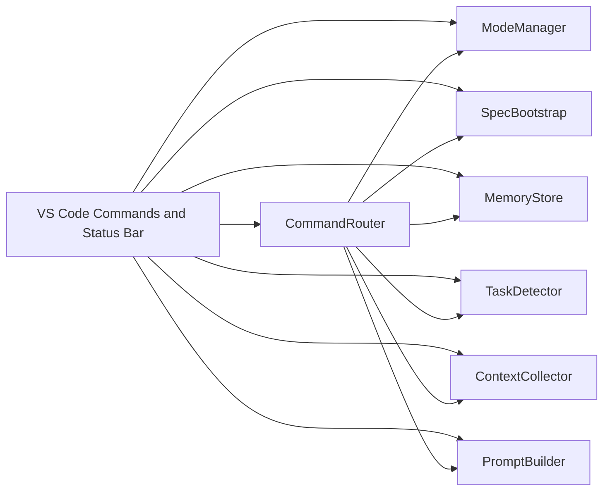

# Design Document: VS Code Kiro Extension

## Overview

The extension reproduces Kiro-style workflow mechanics inside VS Code without replicating Kiro’s proprietary product internals. The design focuses on the behaviors that matter for day-to-day development:

1. A dual-mode workflow that switches between Spec mode and Vibe mode
2. A filesystem-native spec bundle under `.kiro/specs/`
3. Persistent project memory under `.kiro/`
4. Task detection across markdown and source files
5. Prompt generation for a Plan -> Build -> Improve loop
6. Slash-command routing that binds these primitives together

## Architecture

## Component Design

### Extension Activation Layer

`extension.js` is intentionally thin. It wires VS Code commands to the internal services and updates a status bar item that shows the current workflow mode.

### ModeManager

Stores the current mode in workspace state. This supports the visible dual-mode behavior without coupling prompt logic directly to the UI.

### SpecBootstrap

Creates a standard spec bundle:

- `requirements.md`
- `design.md`
- `tasks.md`

This mirrors the local `.kiro/specs` convention already present in the repository.

### TaskDetector

Scans the workspace for:

- Markdown checklist items
- Inline `TODO`, `FIXME`, and `XXX` markers

This gives the extension Kiro-like “automatic task detection” using transparent filesystem rules instead of opaque inference.

### MemoryStore

Persists project notes to `.kiro/kiro-assistant-memory.json`. The storage format is plain JSON so it remains editable and easy to inspect.

### ContextCollector

Builds a small context package from selected files and stored memory. The collector stays conservative:

- bounded file count
- bounded snippet size
- no binary handling
- no dependency on external indexing services

### PromptBuilder

Generates three prompt types:

- Plan
- Build
- Improve

Each template is mode-aware. Spec mode leans on structure; Vibe mode is lighter and more implementation-forward.

### CommandRouter

Routes slash commands into the same shared services used by the UI commands. This keeps behavior consistent and makes the workflow testable without VS Code.

## Data Flow

1. The user triggers a command or slash command.
2. The extension resolves the active mode.
3. If the command needs workspace context, the collector loads snippets and memory.
4. The prompt builder or task detector produces the result.
5. VS Code renders the result in a message, panel, or opened document.

## Testing Strategy

The core services are plain Node modules and are tested without the VS Code runtime. The test suite covers:

- mode persistence behavior
- checkbox and inline task parsing
- spec creation
- memory persistence
- prompt generation
- slash-command routing

This keeps the extension maintainable and allows fast local verification with `node --test`.
